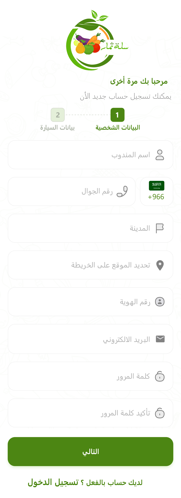
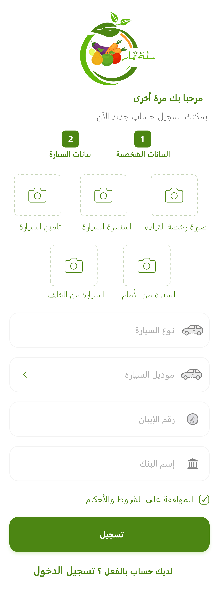
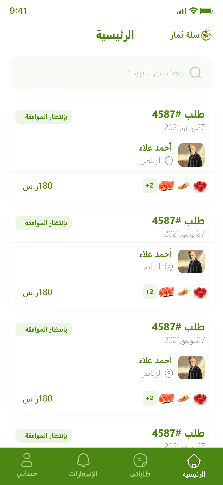
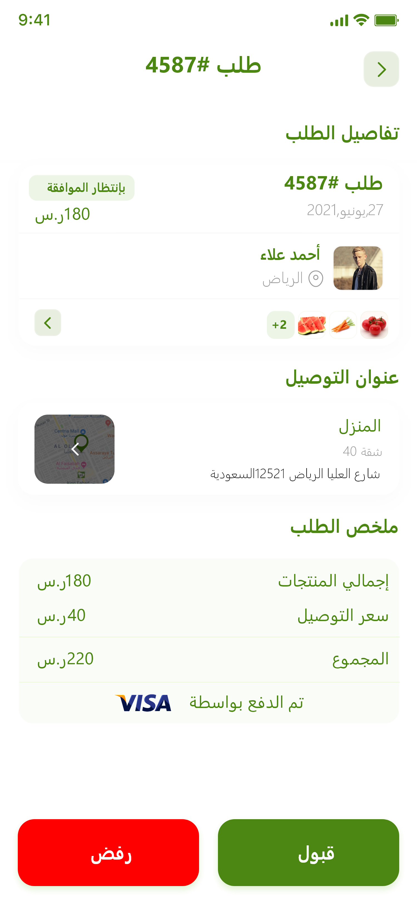
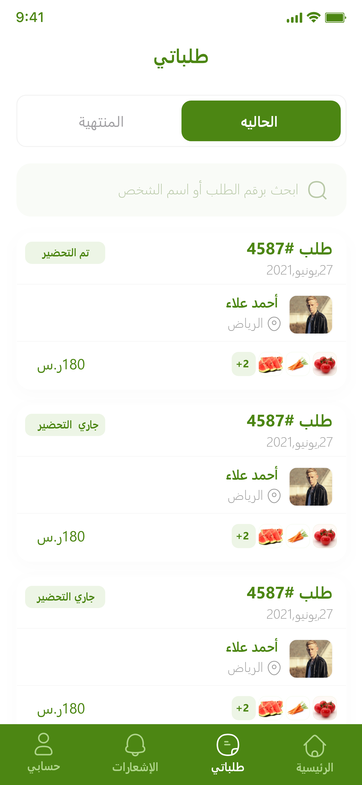
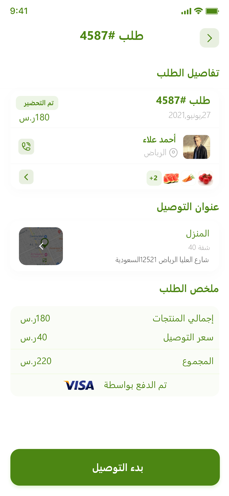

# 🚚 Thimar Driver – Delivery Management App

**Thimar Driver** is the delivery companion app for the Thimar grocery delivery system, built using **Flutter**.  
It’s designed to help drivers manage, track, and complete delivery orders efficiently — from accepting new orders to marking deliveries as complete.

Developed using **BLoC state management**, **Dio + Retrofit** for API networking, and **SharedPreferences** for local caching,  
Thimar Driver provides a smooth, reliable, and performance-focused experience for delivery agents.

---

## 📝 About the App

Thimar Driver enables delivery partners to handle all delivery operations in one place:
- Receive and view **current delivery orders**
- Access **order details, customer info, and locations**
- Use **Google Maps** to navigate to delivery destinations
- Update **order statuses** (accepted, on the way, delivered)
- View **finished orders** and delivery history
- Receive **real-time notifications** about new or updated orders

---

## 🚀 Key Features

- 📦 **Current Orders:**  
  View all active delivery orders assigned to the driver.

- ✅ **Finished Orders:**  
  Review completed and delivered orders with details.

- 🧭 **Order Details Screen:**  
  Includes customer name, phone, address, and total price, with integrated map navigation.

- 🔔 **Notifications:**  
  Receive alerts for new orders or status changes in real-time.

- 👤 **Driver Profile:**  
  Display and manage personal info such as name, phone, and profile image.

- 📍 **Location Tracking:**  
  Integrates with maps for directions and delivery routes.

- 💾 **Local Data Storage:**  
  Cache user data (token, session info) using SharedPreferences.

- 🌐 **API Integration:**  
  Uses Dio + Retrofit for all backend communication.

- ⚙️ **State Management:**  
  Built with BLoC / Cubit for clear and reactive app states.

---

## 🧑‍💻 Tech Stack

- Flutter  
- Dart  
- BLoC / Cubit  
- Dio + Retrofit  
- SharedPreferences  
- Google Maps API  
- RESTful API

---

## 📱 App Screenshots

  
  
  

  
  
  

---

## 🧰 Installation

Before running the project, ensure the following tools are installed:

- ✅ Flutter SDK  
- ✅ Android Studio or Visual Studio Code  
- ✅ Emulator or physical Android/iOS device
